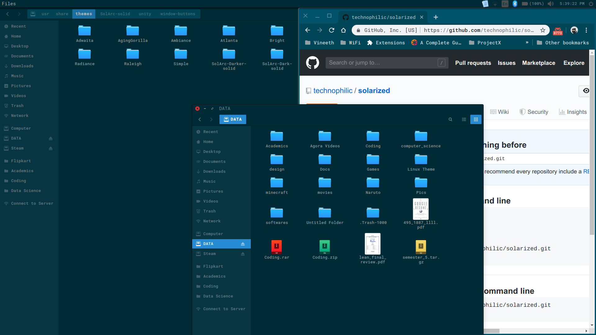
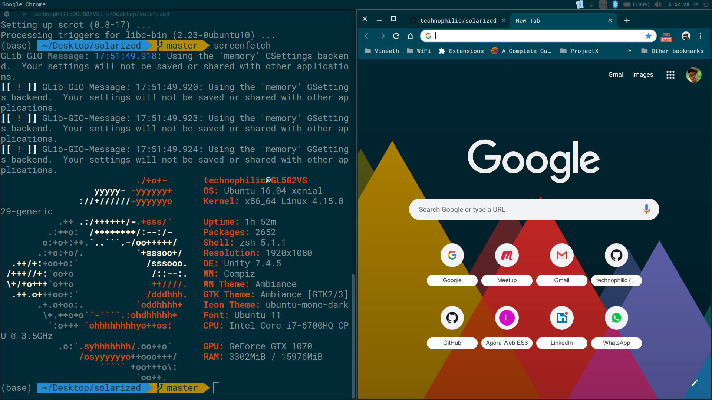
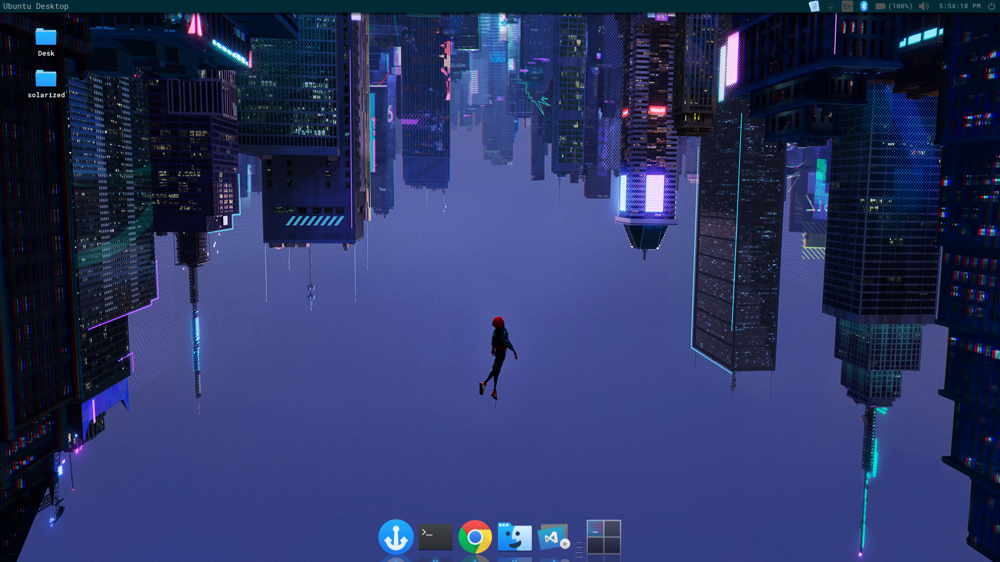

# Solarized theme for Gnome, unity, xfce and more..

This repository contains ready to use themes prebuilt from [Solark](https://github.com/schemar/solarc-theme) theme.

Original [solark](https://github.com/schemar/solarc-theme) project builds upons the popular [Ark](https://github.com/horst3180/arc-theme) theme.

### Note: This is built with no transparency(solid).

Build [configuration](https://github.com/schemar/solarc-theme/blob/master/README.md#manual-installation):


```
./autogen.sh --prefix=/usr --disable-transparency
```

Built on Ubuntu 16.04 (kernel v4.15.0-29-generic).

### Install instructions:

1. Download

2. Extract to /usr/share/themes
or ~/.themes (create it (in your home folder) if necessary);

3. Change via distribution specific tweak tool.


**Note:** If your distribution doesn't ship separate development packages you just need GTK 3 instead of the `-dev` packages.

For the theme to function properly, install the following
* Gnome Shell, GTK 3.14 - 3.22
* The `gnome-themes-standard` package
* The murrine engine. This has different names depending on your distro.
  * `gtk-engine-murrine` (Arch Linux)
  * `gtk2-engines-murrine` (Debian, Ubuntu, elementary OS)
  * `gtk-murrine-engine` (Fedora)
  * `gtk2-engine-murrine` (openSUSE)
  * `gtk-engines-murrine` (Gentoo)


After the installation is complete the theme can be activated with gnome-tweak-tool or a similar program by selecting `SolArc-solid`, `SolArc-Darker-solid` or `SolArc-Dark-solid` as Window/GTK+ theme and `SolArc-solid` or `SolArc-Dark-solid` as GNOME Shell/Cinnamon theme.

### Awesome solarized:

* [Chrome theme](https://chrome.google.com/webstore/detail/solarized-dark-refresh-th/jinmjipikfdhmacpjdddmpffflhehcah?hl=en)
* [VS Code](https://marketplace.visualstudio.com/items?itemName=ryanolsonx.solarized)
* [Jetbrains](https://www.material-theme.com/) (solarized is one of the themes)
* [Wallpaper](https://wallhere.com/en/wallpaper/1225673)

### Screenshots:




